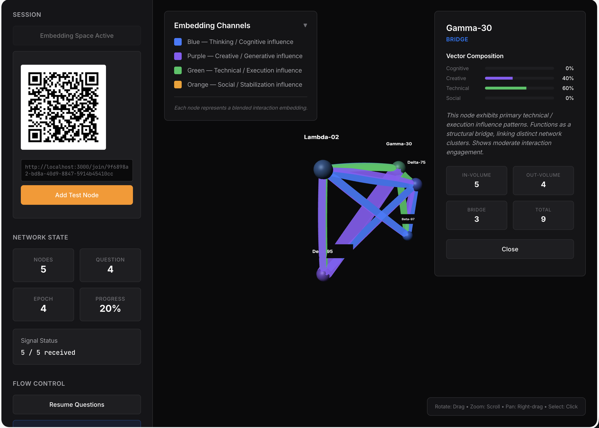
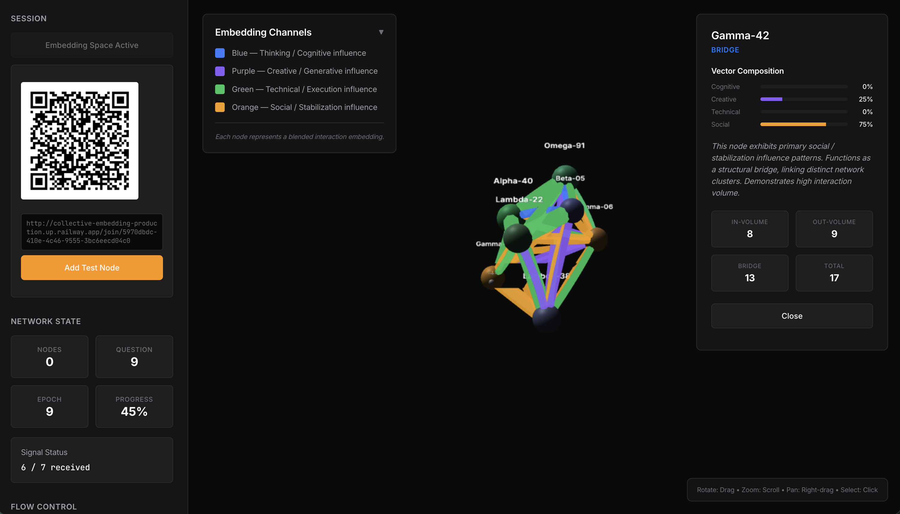

# Collective Embedding

**Interactive live experiment showing humans as language models see them - abstract patterns of interaction without identities**

## Overview

Collective Embedding turns a classroom into a live representation of how language models internally structure humans: not as identities or individuals, but as relational patterns mapped into a multi-dimensional embedding space.
The public visualization never exposes personal identities. What remains visible is only the machine-native layer: vectors, flows, and structural roles.

## Concept

This experiential system simulates a language model's mode of representation by:

**Removing identity from the public layer**
Participants interact using real names on their own devices, but the shared visualization contains no personal identifiers — only abstract nodes and relations.

**Embedding humans as vectors, not profiles**
Four interaction dimensions (Thinking, Creative, Technical, Social) are combined into blended representation vectors, mirroring how models encode meaning through relative positioning.

**Modeling accumulation instead of instant judgment**
The network evolves through training-like "epochs", emphasizing gradual pattern formation rather than momentary attention.

**Adopting a machine-native visual language**
The interface avoids social or gamified metaphors and instead presents a calm, structural, projection-oriented representation of group dynamics.


*The admin interface showing real-time network visualization with nodes colored by embedding vectors and edges scaled by interaction weight*


*Admin interface during an active session showing question flow control, participant metrics, and real-time network formation*

## Four-Channel Embedding Model

The system captures human relationships across exactly four interaction channels:

### 1. Cognitive / Thinking (Blue - #3A7BFF)
- Insight, reframing, intellectual influence
- Questions: "Who helps you think through complex problems?"

### 2. Creative / Generative (Purple - #8B5CF6)  
- Original ideas, novelty, inspiration
- Questions: "Who comes up with the most original ideas?"

### 3. Technical / Execution (Green - #22C55E)
- Practical problem solving, making, coding, hardware
- Questions: "Who would you go to for technical help?"

### 4. Social / Stabilization (Orange - #F59E0B)
- Emotional support, listening, morale, group cohesion
- Questions: "Who creates the most positive group energy?"

## Data Model

### Edges (Connections)
Each answer creates a weighted directed edge with:
- `fromNodeId` - Source participant
- `toNodeId` - Target participant  
- `channel` - One of: cognitive, creative, technical, social
- `weight` - Accumulated strength
- `timestamp` - When created

### Nodes (Participants)
Each node maintains an embedding vector:
- `cognitiveWeight` - Incoming cognitive influence
- `creativeWeight` - Incoming creative influence
- `technicalWeight` - Incoming technical influence  
- `socialWeight` - Incoming social influence

Colors are blended based on normalized channel weights.

## Visualization Features

### Node Representation
- **Color**: Weighted blend of four channel colors based on incoming connections
- **Size**: Total interaction volume (sum of all channels)
- **Label**: Anonymous identifiers (Alpha-01, Beta-23, etc.) or pure abstraction after identity removal
- **No personal identifiers** are ever displayed

### Edge Representation
- **Color**: Matches the interaction channel (blue/purple/green/orange)
- **Thickness**: Reflects accumulated connection weight
- **Transparency**: Based on connection strength

### Interactive Node Profiles
Click any node to see machine-style analysis:
- **Vector composition**: Percentage breakdown across four channels
- **Structural role**: Connector, Amplifier, Initiator, Bridge, Stabilizer
- **Machine language**: Observational, non-judgmental descriptions

Example: *"This node exhibits primary creative / generative influence patterns. Functions as a structural bridge, linking distinct network clusters. Demonstrates high interaction volume."*

## Experience Flow

### 1. Pre-Session (Screensaver Mode)
- Synthetic animated network simulation
- Abstract nodes appearing/dissolving
- Cycling text: "Preparing embedding space", "Waiting for interaction signals"

### 2. Participant Joining
- QR code or URL joins participants
- Names collected locally on devices only
- Public view shows anonymous node appearance

### 3. Question Flow
- 20 questions across four channels (5 per channel)
- Real-time responses update embedding vectors
- Automatic advancement with session end handling

### 4. Identity Removal (Optional)
- Permanent deletion of name-to-node mappings
- Switch to pure embedding view (Node-01, Node-02...)
- Demonstrates transition from social to machine perspective

## Classroom Usage

### Recommended Setup
- **Participants**: 5-10 people (optimal group size)
- **Duration**: ~10 minutes
- **Display**: Project admin interface for group viewing
- **Devices**: Participants join via smartphones/laptops

### Running a Session
1. Open admin interface: `https://collective-embedding-production.up.railway.app/admin` (or locally at `http://localhost:3000/admin`)
2. Click "Initialize Embedding Space"
3. Share QR code or join URL with participants
4. Click "Start Questions" to begin automatic question flow
5. Use "Pause Questions" to control flow if needed
6. Optional: Click "End Session" to terminate or wait for natural completion

### Key Controls
- **Start Questions**: Begin automatic question sequence
- **Pause/Resume Questions**: Control question flow during session
- **End Session**: Manually terminate session and reset
- **Add Test Node**: Add simulated participants for testing

## Technical Architecture

### Server (`server/index.js`)
- Node.js with Express and Socket.IO
- Four-channel data model with embedding calculations
- Real-time WebSocket communication
- RESTful API for session management

### Client (`client/admin.html`) 
- Three.js 3D network visualization
- Real-time embedding color blending
- Interactive node selection and analysis
- Machine-aesthetic design language

### Visualization Logic

#### Node Color Blending
```javascript
// Blend four channel colors based on embedding weights
function generateNodeColor(embedding) {
  const totalWeight = Object.values(embedding).reduce((sum, val) => sum + val, 0);
  let r = 0, g = 0, b = 0;
  
  for (const [channel, weight] of Object.entries(embedding)) {
    const color = channels[channel].color;
    const rgb = hexToRgb(color);
    const factor = weight / totalWeight;
    r += rgb.r * factor;
    g += rgb.g * factor;
    b += rgb.b * factor;
  }
  
  return `rgb(${Math.round(r)}, ${Math.round(g)}, ${Math.round(b)})`;
}
```

#### Role Detection
Algorithms automatically classify structural roles:
- **Bridge**: High betweenness centrality, links clusters
- **Amplifier**: High incoming edge volume
- **Initiator**: High outgoing edge volume  
- **Connector**: High bidirectional connectivity
- **Stabilizer**: Consistent interaction patterns

## Design Philosophy

### Machine-Native Aesthetics
- Dark theme with precise typography
- Clean geometric forms
- No playful or gamified elements
- Optimized for projector visibility

### Experiential, Not Analytical
Built as an experience system that helps groups understand how:
- Language models see patterns instead of people
- Individual identities dissolve into interaction vectors
- Social networks become mathematical representations
- Human complexity reduces to computational abstractions

### Privacy by Design
- Names never stored persistently
- Identity removal is permanent and irreversible
- Public view never reveals personal identifiers
- Focus on patterns, not individuals

## 🚀 Live Demo

**Try the system now:** https://collective-embedding-production.up.railway.app

### Access Points
- **🎛️ Admin Interface**: https://collective-embedding-production.up.railway.app/admin
- **📱 Participant Join**: https://collective-embedding-production.up.railway.app/
- **📖 Source Code**: https://github.com/maayanmag/Collective-Embedding

### Quick Demo Steps
1. Open admin interface at the URL above
2. Click "Initialize Embedding Space" 
3. Share the QR code with participants
4. Click "Start Questions" to begin
5. Watch real-time network formation

## Installation & Setup

### Prerequisites
- Node.js 16+ 
- npm or yarn
- Modern web browser with WebGL support

### Local Development
```bash
# Clone repository
git clone https://github.com/maayanmag/Collective-Embedding.git
cd Collective-Embedding

# Install dependencies
npm install

# Start development server
npm run dev

# Open admin interface
open http://localhost:3000/admin
```

### Production Deployment
The app is deployed on Railway and requires a Node.js environment with WebSocket support.

```bash
# Start production server  
npm start
```

## API Endpoints

### Session Management
- `POST /api/session/create` - Initialize new session
- `GET /api/session/status` - Get current session state
- `GET /api/session/graph` - Retrieve network data with embeddings
- `POST /api/session/end` - Manually terminate session

### Question Flow
- `POST /api/session/start-questions` - Begin automatic question sequence
- `POST /api/session/pause-resume` - Pause or resume question flow
- `POST /api/session/next-question` - Advance to next question (legacy)

### Node Analysis  
- `GET /api/session/node/:nodeId` - Get detailed node profile with embedding data

## License

MIT License - Feel free to use for educational and research purposes.

---

*An exploration of human-machine perception by Bezalel Academy*
